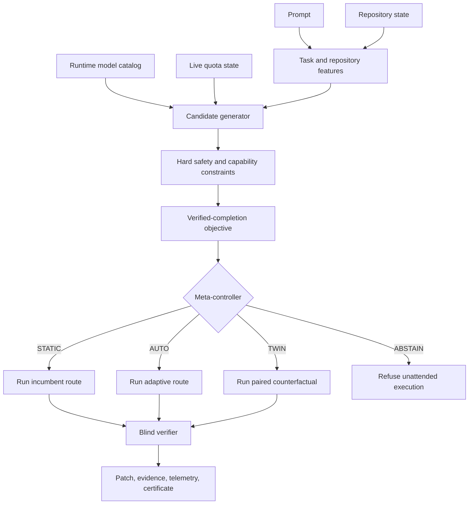
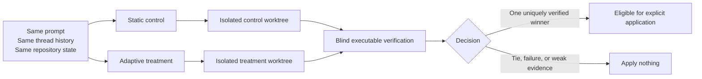

<div align="center">

# Counterlane

### Verification-gated compute governor for Codex

**Counterlane is the verification-gated compute governor for Codex: start with the least expensive admissible route, prove the result, escalate only on bounded evidence, and show the complete route receipt.**

[](LICENSE)
[](package.json)
[](tsconfig.json)
[](https://developers.openai.com/codex/app-server)
[](https://developers.openai.com/codex/mcp)
[](RELEASE_STATUS.json)

**[Quick start](#quick-start)** · **[Product workflow](#product-workflow)** · **[Integrations](#integration-surfaces)** · **[Configuration](#configuration)** · **[Research](#research-and-evaluation)**

</div>

---

Counterlane is a local, verification-first control plane for Codex. Its product execution path performs a no-spend preflight, freezes a task-specific verifier contract, runs one isolated route, and records a versioned non-applying receipt. A failed verifier is a detected failure, not a success with a confidence adjustment.

> [!NOTE]
> Counterlane is an independent research and engineering project. It is not affiliated with or endorsed by OpenAI.

## Product workflow

The preferred MCP path is counterlane_execute. It never starts a hidden Twin, Compare, background exploration, or patch application.

1. The host supplies a trusted, task-specific verifier policy whose immutable external entrypoint declares a data-only candidate contract.
2. Counterlane validates runtime capability, quota, repository state, verification containment, and the frozen execution envelope before a model turn starts.
3. It starts one isolated route and may make at most one strict sequential escalation after observed failure. A successor must be connected by the frozen explicit capability graph; a scalar score, speed tier, or proof tier cannot create an escalation edge.
4. It returns a redacted public receipt and persists an authoritative local receipt. Actual provider billing and external adjudication remain explicitly unavailable unless separately observed.

Product speed has three permissions:

- **Off** forces Standard.
- **Auto** may select an advertised premium tier only under its explicit foreground and deadline or urgency gates.
- **Fast** requests an advertised configured premium tier or fails closed.

Raw service-tier IDs and paired comparisons remain advanced Research surfaces. A faster tier does not receive a capability bonus.

## Why Counterlane?

Most routers ask:

> Which model appears capable enough for this prompt?

Counterlane asks:

> Which complete route minimizes expected cost and time to a **verified** result, under the current quota, repository risk, and available evidence?

A route is five-dimensional:

```text
route = model × reasoning effort × speed/service tier × topology × verifier
```

| Dimension | What it controls |
|---|---|
| **Model** | Capability family and judgment level |
| **Reasoning effort** | Depth of deliberation |
| **Speed tier** | Latency and credit economics, independent of intelligence |
| **Topology** | Single-agent depth or separable multi-agent breadth |
| **Verifier** | Evidence required before accepting a result |

This separation matters. Fast is not a smarter model. Max is not Ultra. A difficult task with strong deterministic tests may safely use a cheaper route, while a small authentication change with weak verification may require a stronger one.

## Highlights

| Capability | Description |
|---|---|
| **Runtime-aware routing** | Discovers model IDs, supported efforts, and advertised service tiers from Codex instead of hard-coding them. |
| **Speed-aware optimization** | Scores standard, fast, and custom runtime tiers as latency/economic interventions. |
| **Self-falsifying Auto** | Chooses `STATIC`, `AUTO`, `TWIN`, or `ABSTAIN` instead of forcing Auto on every task. |
| **Paired counterfactual execution** | Runs static and adaptive policies from the same initial state in isolated worktrees. |
| **Blind verification** | Evaluates both arms without exposing policy identity to verifier commands. |
| **Quota governance** | Accounts for live rate limits, reserves, retry cost, and exploration overhead. |
| **Safe patch application** | Applies only an explicit, uniquely verified winner when the original checkout is unchanged. |
| **Codex integration** | Provides a root CLI, Codex skill, local plugin, and stdio MCP server. |
| **Research telemetry** | Records route, cost, latency, verification, reroutes, and paired outcomes without storing raw prompts by default. |

## Project status

Counterlane is a local release candidate for Windows hosts with Node.js 22 and Git. Its machine-readable state is currently [`approval_required`](RELEASE_STATUS.json). Run `npm run release:status` to verify that state. Deterministic checks and simulated fixtures cannot change it to `production_ready`; that transition requires a fresh owner-authorized runtime smoke bound to the final source manifest, launcher digests, a certifying verifier result, bounded attempt accounting, and observed cleanup.

The repository includes product execution, Research comparison surfaces, verification, receipts, packaging checks, a Codex plugin, an MCP server, protocol mocks, and automated tests. It makes no claim of measured savings, real provider economics, live model quality, hosted availability, or multi-tenant operation.

Linux and macOS are currently untested support boundaries. A hosted deployment, organization authentication, remote workspace isolation, cancellation propagation, observability, and secret management are future work rather than bundled product claims.

## How it works



### Paired counterfactual execution



A best-of-two result is evidence acquired by running both policies. Counterlane records the full exploration cost and does not present the result as proof that the router knew the winner in advance.

## Integration surfaces

| Surface | Invocation | Recommendation | Delegated execution | Change active parent turn |
|---|---|---:|---:|---:|
| **Counterlane CLI** | `counterlane auto ...` | Yes | Yes | **Yes—it owns the root turn** |
| **Codex CLI skill/plugin** | `$counterlane ...` | Yes | Yes | No |
| **Codex IDE extension** | `$counterlane ...` | Yes | Yes | No |
| **ChatGPT desktop with local MCP/plugin support** | Select or mention Counterlane | Yes | Yes on the connected host | No |
| **ChatGPT Work on the web** | Installed remote plugin/app | Yes | Yes in its remote environment | No |

> [!IMPORTANT]
> A skill or MCP tool is invoked after the current ChatGPT or Codex turn has already selected its model, reasoning effort, and speed tier. It can start a **new delegated Counterlane run**, but it cannot retroactively rewrite the active parent turn.
>
> Use the Counterlane CLI when transparent pre-turn routing is required.

### Root CLI: full pre-turn control

The CLI connects to `codex app-server`, chooses the route, and supplies the selected model, effort, service tier, working directory, and sandbox before the managed turn starts.

```bash
counterlane auto \
  --latency-priority balanced \
  --prompt "Fix the failing refresh-token test and add a regression test."
```

### Codex CLI and IDE extension

Counterlane ships a bundled plugin skill and MCP server:

```text
.codex-plugin/plugin.json
.mcp.json
skills/counterlane/SKILL.md
skills/counterlane/agents/openai.yaml
```

Invoke it explicitly:

```text
$counterlane inspect this task and recommend the safest efficient route.
```

The portable plugin copy is self-contained after `npm run build`: its MCP manifest starts `node dist/cli.js mcp --stdio` from the plugin root. A global Counterlane installation is not required after the plugin has been copied into the personal marketplace.

### ChatGPT desktop

The local stdio MCP server can run on a connected desktop host that has:

- the installed Counterlane plugin bundle;
- access to the target Git repository;
- an authenticated Codex installation;
- permission to run the configured verifier commands.

Example:

```text
Use Counterlane to recommend a route for this task. Explain model, effort,
speed tier, topology, quota trade-offs, and verification. Do not execute it.
```

### ChatGPT Work on the web

ChatGPT Work on the web does not execute a local stdio process or read local Codex configuration. Full execution requires a remotely reachable MCP-backed app running in an environment with authorized repository and Codex access.

A hosted deployment should provide:

- Streamable HTTP MCP;
- per-user or per-workspace authentication;
- repository authorization and tenant isolation;
- disposable workspaces for each counterfactual arm;
- cancellation and timeout propagation;
- encrypted secrets and artifacts;
- audit logs and explicit write-action policy.

The repository includes the local control surface and deployment boundary documentation; it does not ship a hosted service.

## Requirements

- **Node.js 22 or newer**
- **Git** with worktree support
- A current **Codex CLI** installation
- Codex authentication configured on the execution host
- A Git repository containing the task target
- At least one meaningful executable verifier for safe application

## Installation

Clone the repository, then build and expose the CLI:

```bash
npm ci
npm run check
npm run build
npm link
```

Confirm the environment:

```bash
counterlane doctor
counterlane models
```

Without `npm link`:

```bash
node dist/cli.js help
```

## Quick start

Run these commands inside the Git repository you want Counterlane to inspect or modify.

### Create a configuration

```bash
counterlane init
```

### Preview a route without running Codex

```bash
counterlane route --prompt \
  "Fix the failing refresh-token test without changing the public API."
```

Optimize more aggressively for latency:

```bash
counterlane route \
  --latency-priority urgent \
  --prompt "Urgent production regression: diagnose the failure and prepare a verified patch."
```

### Ask the outer controller what to do

```bash
counterlane decide --prompt \
  "Fix the failing refresh-token test without changing the public API."
```

Possible decisions:

```text
STATIC   Retain the incumbent policy
AUTO     Run the adaptive route
TWIN     Acquire paired counterfactual evidence
ABSTAIN  Refuse unattended execution
```

### Execute the selected policy

```bash
counterlane auto --prompt \
  "Fix the failing refresh-token test without changing the public API."
```

No patch is applied to the original checkout unless `--apply` is explicit.

### Compare Auto and static

```bash
counterlane compare --prompt \
  "Fix the failing refresh-token test without changing the public API."
```

Apply only a uniquely verified winner:

```bash
counterlane compare \
  --apply-winner \
  --prompt "Fix the failing refresh-token test without changing the public API."
```

> [!CAUTION]
> Review generated artifacts before applying a result. Counterlane prevents several classes of accidental application, but verification quality remains limited by the available tests and specifications.

### Continue from an existing Codex thread

```bash
counterlane compare \
  --thread-id THREAD_ID \
  --last-turn-id OPTIONAL_COMPLETED_TURN_ID \
  --prompt "Implement the next requested change."
```

Each arm receives a separate fork of the same stored conversation history.

## Routing profiles

| Profile | Intended behavior |
|---|---|
| `economy` | Prioritize quota preservation and lower normalized cost |
| `balanced` | Balance quality, cost, latency, and recovery risk |
| `quality` | Accept more compute for stronger expected success and verification |

Set `routing.profile` in `counterlane.config.json`. Profiles change the objective; they do not invent unsupported capabilities or bypass safety floors. Use `--latency-priority urgent` as a per-task soft preference for lower latency.

### Quota degradation and exhaustion

Counterlane remains usable when quota is merely low. Live reserve pressure disables paired Twin exploration and can reject premium speed, Max, or Ultra while retaining an admissible Standard single-lane route. If quota telemetry is unavailable, the same expensive dimensions fail closed, but a Standard single lane can still run when its model, safety floor, and verifier requirements are satisfied.

A known exhausted window is different: when usage reaches 100%, remaining quota is zero, or the App Server reports `rate_limit_reached`, every delegated route becomes inadmissible and Counterlane abstains before starting a coding turn. Counterlane cannot replenish or bypass an exhausted Codex account quota. The current catalog does not advertise a model-to-quota-bucket binding, so when multiple buckets are present Counterlane conservatively uses the most constrained observed bucket rather than guessing that a different model can spend from a separate bucket.

## CLI reference

| Command | Purpose |
|---|---|
| `counterlane init` | Write a complete default configuration |
| `counterlane doctor` | Validate Node, Git, Codex, App Server, catalog, quota, and verifier discovery |
| `counterlane models` | Print runtime models, supported efforts, and advertised service tiers |
| `counterlane route` | Score admissible routes without executing a coding turn |
| `counterlane decide` | Run the meta-controller without executing |
| `counterlane auto` | Execute `STATIC`, `AUTO`, `TWIN`, or `ABSTAIN` |
| `counterlane run` | Run one explicit static or adaptive policy in an isolated worktree |
| `counterlane compare` | Run a paired Auto-versus-static experiment |
| `counterlane history` | Read recent local telemetry |
| `counterlane mcp` | Start the local stdio MCP server |

Common options:

```text
--cwd PATH
--config FILE
--prompt TEXT
--prompt-file FILE
--thread-id THREAD_ID
--last-turn-id TURN_ID
--model MODEL_ID
--family luna|terra|sol
--effort EFFORT
--speed SERVICE_TIER
--topology single|ultra
--proof-tier basic|standard|strong|adversarial
--deadline-ms MILLISECONDS
--max-credits NUMBER
--latency-priority auto|economy|balanced|urgent
--json
--verbose
```

Prompts are trimmed, must be non-empty, and are limited to 1 MiB whether supplied by CLI, MCP, or the programmatic runners.

<details>
<summary><strong>More CLI examples</strong></summary>

```bash
counterlane run \
  --mode static \
  --prompt "Add tests for the parser edge cases."

counterlane run \
  --mode auto \
  --prompt-file task.md

counterlane history --limit 20 --json
```

</details>

## Local plugin installation

Build, validate, and install a portable copy into the personal marketplace:

```bash
npm ci
npm run check
node dist/cli.js plugin install-local --copy
codex plugin add counterlane@personal
```

Then:

1. Open `/plugins` in Codex CLI, or **Settings → Plugins** in the IDE extension.
2. Confirm that **Counterlane** is installed.
3. Start a new session or chat so Codex reloads the plugin.
4. Invoke `$counterlane` explicitly.

Use `--link` instead of `--copy` only while developing the plugin locally.

The plugin exposes:

| MCP tool | Side effects | Purpose |
|---|---:|---|
| `counterlane_models` | Read-only | Inspect model, effort, speed-tier, and quota availability |
| `counterlane_route` | Read-only | Recommend a route without execution |
| `counterlane_decide` | Read-only Research | Inspect Static, Auto, Twin, or Abstain; starts no model turn |
| `counterlane_execute` | Isolated product execution | Run bounded verification-gated execution with Off, Auto, or Fast speed permission; never starts Twin or Compare |
| `counterlane_run` | Isolated advanced execution | Run one explicit static or adaptive arm |
| `counterlane_compare` | Isolated Research | Run exactly two expensive comparison arms; not the product default |

MCP execution never applies a patch to the original repository. Application remains an explicit CLI operation after review.

The product response has a versioned schema and includes receipt metadata. The local receipt contains route, observed verifier, timing, attempt, reroute, and accounting-boundary evidence without raw prompts. The public receipt is deterministically redacted and does not expose local artifact paths.

## Speed is a first-class control

Counterlane treats speed independently from model capability and reasoning depth.

```text
Sol + Medium + Standard
Sol + Medium + Fast
```

These routes may use the same model and effort while having different latency, cost, and quota characteristics.

Counterlane reads service tiers from each runtime model entry and creates only supported candidates. It does not infer Fast support from a model name or from another model's catalog.

Speed affects:

- expected latency;
- normalized cost;
- quota pressure;
- the value of avoiding a retry under a deadline;
- utility of the complete verified workflow.

Speed does **not** directly increase capability or success estimates.

For the product MCP workflow, use the explicit Off, Auto, or Fast permission rather than a raw service-tier string. Auto and Fast fail closed when the host has not advertised and configured the requested premium tier.

Configured cost and latency multipliers are bootstrap estimates. Production use should calibrate them from measured outcomes for each:

```text
model × effort × service tier × task family
```

## Configuration

Generate a default file:

```bash
counterlane init
```

See [`counterlane.config.example.json`](counterlane.config.example.json) and [`docs/configuration.md`](docs/configuration.md).

### Freeze the verification contract

Explicit verifier commands are preferable for reproducible experiments:

```json
{
  "verification": {
    "autoDetect": false,
    "requireAtLeastOne": true,
    "failOnNoVerifier": true,
    "requireTaskSpecificCheck": true,
    "commands": [
      {
        "name": "tests",
        "command": ["npm", "test"],
        "required": true,
        "taskSpecific": true,
        "candidateCodePolicy": "executes-candidate-code",
        "minimumTier": "standard",
        "timeoutMs": 900000
      },
      {
        "name": "typecheck",
        "command": ["npm", "run", "typecheck"],
        "required": true,
        "minimumTier": "basic"
      }
    ]
  }
}
```

Verifier commands run directly as argument arrays, not through a shell.

`taskSpecific: true` is an explicit policy assertion that the command exercises
the delegated task contract. With `requireTaskSpecificCheck: true`, generic
repository-health checks may still run as supporting evidence but cannot earn
proof credit by themselves. This assertion does not replace an external oracle.

`candidateCodePolicy` declares whether the verifier treats candidate files as
data only or executes/imports them. Repository test runners should declare
`executes-candidate-code`. Product MCP certification is narrower: it requires a
host-authorized, absolute external verifier entrypoint with
`candidateCodePolicy: "data-only"`. Inline interpreter programs and wrappers
inside the candidate repository remain non-certifying even if a host policy
names them.

Auto-detection recognizes common entry points such as `npm test`, npm type-check scripts, optional npm lint scripts, `pytest`, `cargo test`, and `go test ./...`.

## Safety model

Counterlane defaults to containment rather than convenience.

- Every managed coding run executes in a detached Git worktree.
- Twin arms start from equivalent tracked, staged, dirty, and untracked source state.
- Network access is disabled by default.
- Unattended approval requests are declined.
- The original checkout is unchanged unless application is explicit.
- An arm is ineligible for application unless the turn completes and every required verifier passes.
- An apply-requested run that fails remains non-applying and persists its failure evidence instead of discarding the result.
- Application is rejected if the original source state changes during the experiment.
- Explicit application reruns the selected verifier in the original checkout and rolls the patch back on failure.
- Existing ignored dependency trees such as `node_modules` are independently copied into each arm; writable links to the original checkout are never created.
- Symlink and path traversal checks prevent isolated artifacts from escaping the intended worktree.
- Raw prompts are excluded from telemetry by default.
- Both arms are included in paired experiment cost.

> [!WARNING]
> Twin execution is not appropriate for irreversible external actions such as deployments, payments, email sending, account changes, or shared remote mutations. Enforce this boundary with sandboxing, credentials, network policy, and tool approvals—not with prompts alone.

See [`docs/threat-model.md`](docs/threat-model.md) and [`SECURITY.md`](SECURITY.md).

## Verification and winner selection

Verifier commands run inside each arm with:

```text
CI=1
COUNTERLANE_BLIND_VERIFIER=1
```

The verifier is not told whether it is evaluating control or treatment. Counterlane records check outcomes, bounded output, patch scope, route identity, token usage, normalized cost, reroute evidence, and total latency.

Only a uniquely verified winner is eligible for explicit application. A tie, two failures, or insufficient verification means **apply nothing**.

## Artifacts and telemetry

Artifacts live under `.counterlane/` by default:

```text
.counterlane/
├── events.jsonl
├── decisions/
│   └── DECISION_ID/decision.json
├── experiments/
│   └── EXPERIMENT_ID/
│       ├── certificate.md
│       ├── control.patch
│       ├── treatment.patch
│       └── result.json
└── runs/
    └── RUN_ID/
        ├── result.json
        └── result.patch
```

Certificates summarize route, speed tier, topology, verification, cost, latency, winner selection, source-state integrity, reroutes, and remaining uncertainty.

Product receipts are not Research certificates. A product receipt reports observed execution facts and its accounting boundary; it does not establish a causal routing benefit or a full-system savings claim.

## Research and evaluation

Counterlane is designed to make routing claims falsifiable.

A paired run holds constant the prompt, conversation history, repository snapshot, dirty state, sandbox policy, and verification contract. The intervention is the execution policy.

Recommended metrics include:

- verified success rate;
- normalized credits per verified completion;
- wall-clock time to verified completion;
- bad-escape rate;
- recovery and retry cost;
- fast-tier utility;
- Ultra waste rate;
- quota survival;
- user correction or rollback rate;
- regret against an oracle route matrix.

Research reports should separate:

1. **Raw exploration cost** — both arms and all verification.
2. **Amortized online cost** — exploration distributed over future decisions.
3. **Steady-state exploitation cost** — the selected single policy after calibration.

A best-of-two twin result must not be presented as proof that the router selected the best arm before execution.

See [`docs/experiment-protocol.md`](docs/experiment-protocol.md) and [`docs/research-notes.md`](docs/research-notes.md).

## Architecture

```text
ChatGPT / Codex skill / plugin
              │
              │ nested MCP invocation
              ▼
Counterlane CLI and App Server client
              │
              ▼
repository profiler ─ runtime catalog ─ quota governor
              │               │               │
              └───────────────┴───────────────┘
                              ▼
          model × effort × speed × topology × verifier
                              │
                    paired uplift evidence
                              │
                              ▼
                 STATIC / AUTO / TWIN / ABSTAIN
                              │
                 ┌────────────┴────────────┐
                 ▼                         ▼
           static worktree          adaptive worktree
                 │                         │
                 └────────────┬────────────┘
                              ▼
                       blind verifier
                              │
                              ▼
                 patch + evidence + certificate
```

The App Server is the routing control plane. Skills and MCP provide invocation and delegated orchestration, but they cannot modify a parent turn that already started.

See [`docs/architecture.md`](docs/architecture.md).

## Protocol compatibility

Counterlane avoids a closed list of model IDs, effort names, and Fast-supported models. It reads the runtime catalog and preserves unknown protocol fields where possible.

Generate protocol artifacts for the locally installed Codex build:

```bash
npm run protocol:generate
```

Review changes affecting:

```text
Model.supportedReasoningEfforts
Model.serviceTiers
Model.defaultServiceTier
TurnStartParams.model
TurnStartParams.effort
TurnStartParams.serviceTier
ThreadForkParams.serviceTier
```

See [`docs/protocol-compatibility.md`](docs/protocol-compatibility.md).

## Development

```bash
npm ci
npm run typecheck
npm test
npm run check
```

The project uses strict TypeScript and has no production runtime dependencies.

<details>
<summary><strong>Repository map</strong></summary>

```text
src/
├── cli.ts                    command dispatch
├── cli/                      prompts and diagnostics
├── codex/                    App Server transport, catalog, protocol, cost
├── config/                   defaults, schema, and JSONC loading
├── core/                     errors, logging, processes, shared types
├── git/                      repository profile, snapshots, worktrees
├── mcp/                      local MCP server
├── meta/                     uplift evidence, EVSI, and outer decisions
├── report/                   console output and certificates
├── routing/                  features, quota, and joint route selection
├── runner/                   single, paired, arm, and meta execution
├── telemetry/                append-only local evidence store
└── verification/             detection, execution, and mutation math
```

</details>

## Documentation

| Document | Purpose |
|---|---|
| [`docs/architecture.md`](docs/architecture.md) | Runtime boundaries and system design |
| [`docs/integrations.md`](docs/integrations.md) | Surface-specific integration behavior |
| [`docs/configuration.md`](docs/configuration.md) | Configuration reference and tuning |
| [`docs/experiment-protocol.md`](docs/experiment-protocol.md) | Paired evaluation methodology |
| [`docs/protocol-compatibility.md`](docs/protocol-compatibility.md) | App Server compatibility strategy |
| [`docs/research-notes.md`](docs/research-notes.md) | Scientific framing and open questions |
| [`docs/threat-model.md`](docs/threat-model.md) | Threats, boundaries, and mitigations |
| [`docs/roadmap.md`](docs/roadmap.md) | Planned engineering and research work |
| [`CONTRIBUTING.md`](CONTRIBUTING.md) | Contribution workflow |
| [`SECURITY.md`](SECURITY.md) | Vulnerability reporting |

## Known limitations

- The local plugin requires Node.js and a built portable plugin copy on the execution host.
- The bundled plugin uses local stdio MCP; ChatGPT Work web requires a separately deployed remote MCP app.
- MCP treats the App Server launcher and sandbox authority as host-owned: repository config cannot replace the executable, enable network access, or inject extra turn fields.
- Plugin and skill invocation cannot change the model, effort, or speed of the active parent turn.
- Bootstrap coefficients require calibration on real workloads.
- Passing visible checks does not prove complete semantic correctness.
- Fast availability and economics depend on runtime and account capabilities.
- Production compatibility should be validated in authenticated Codex CLI, IDE, desktop, and workspace environments.

## Contributing

Contributions are welcome in routing calibration, causal evaluation, protocol compatibility, verification, security, platform support, and developer experience.

Before opening a pull request:

```bash
npm ci
npm run check
```

Read [`CONTRIBUTING.md`](CONTRIBUTING.md) and [`CODE_OF_CONDUCT.md`](CODE_OF_CONDUCT.md).

## Security

Report suspected vulnerabilities through [`SECURITY.md`](SECURITY.md). Do not publish sensitive repository data, credentials, exploit details, or unsafe proof-of-concept artifacts in a public issue.

## License

Licensed under the [Apache License 2.0](LICENSE). See [`NOTICE`](NOTICE) for attribution information.

---

<div align="center">

**Counterlane does not assume Auto is better. It builds the evidence required to find out.**

</div>
